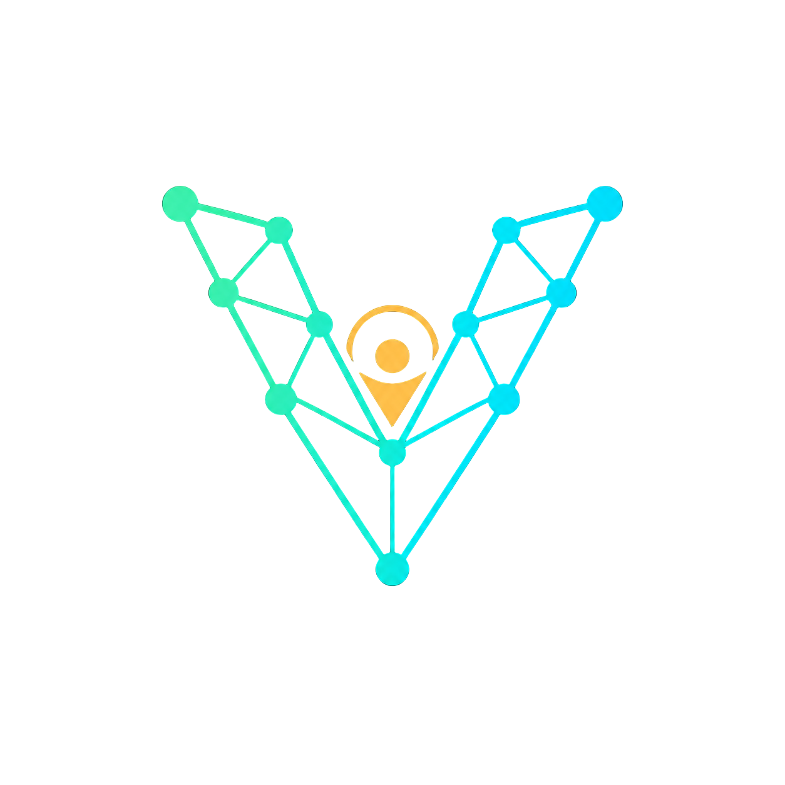

<div align="center">



# Vedansh Tembhre

### PhD Student in Computer Science and Engineering @ UNT
### Computer Vision · 3D Human Motion · Embodied AI

**Building human-centered AI from research to reality.**

I work on AI systems that understand people, motion, and the world around them — with a focus on **3D human pose**, **assistive computer vision**, and **trustworthy AI evaluation**.

**Creator of Vedansh Labs**, an open-source research and engineering initiative for turning AI ideas into practical, reproducible systems.

</div>

---

## Current Research

### ReCTA-Audit — 3D Human Pose Reliability

Research on reliable evaluation of **multi-hypothesis 3D human pose estimation**.

I am studying the gap between the quality that exists inside a model's candidate set and the quality that a deployable selector can actually recover.

**Technical focus**
- Multi-hypothesis 3D pose estimation
- D3DP and MotionAGFormer-K
- MPI-INF-3DHP
- Distribution shift and selector reliability
- Leakage-controlled evaluation
- Reproducible experiment pipelines

---

### SmartSight — Assistive Computer Vision

**Research Assistant, University of North Texas · NASA-funded project**

SmartSight is a context-aware assistive vision system for blind and low-vision users. The goal is to move beyond basic object detection by reasoning about **where an obstacle is, how it is moving, whether it blocks the user's path, and how urgently the user should be warned**.

**Current pipeline**

```text
Video / Camera
      ↓
YOLO Object Detection
      ↓
Spatial + Path Context
      ↓
Object Tracking
      ↓
Motion Reasoning
      ↓
Risk Scoring
      ↓
Adaptive Warning Generation
```

**Technical focus**
- YOLO object detection
- Spatial and path reasoning
- Temporal object tracking
- Approaching / receding / lateral motion classification
- Risk-aware warning generation
- Adaptive compute and alert gating

---

## Vedansh Labs

**Vedansh Labs** is my open-source AI research and engineering initiative focused on building practical systems around three themes:

| Area | Focus |
|---|---|
| **Human Understanding** | 3D human pose, motion, graph and transformer models |
| **Accessible AI** | Assistive computer vision and human-centered interfaces |
| **Trustworthy Intelligence** | Reliable evaluation, AI safety, and reproducible research tools |

The guiding idea is simple:

> AI research should not stop at a paper or isolated experiment. It should become something people can inspect, reproduce, improve, and use.

---

## Selected Projects

### [LitVerify](https://github.com/Vedansh5545/LitVerify) — Vedansh Labs

**Faster, verifiable literature review.**

A local-first workspace for organizing papers, evidence, contradictions, datasets, research gaps, and verifiable claims.

**Built with:** React · TypeScript · local-first storage · reproducible evidence workflows

---

### [LLM ShieldBench](https://github.com/Vedansh5545/llm-shieldbench) — Vedansh Labs

**Lightweight evaluation infrastructure for safer conversational AI.**

A benchmark platform for comparing LLM responses across prompts, models, and safety-oriented scoring criteria while keeping provider credentials non-persistent.

**Built with:** Python · React · LLM evaluation · safety benchmarking · reproducible result storage

---

## Research & Technical Focus

```text
Computer Vision
3D Human Pose Estimation
Human Motion Understanding
Graph Neural Networks
Transformers
PyTorch
Assistive / Accessibility AI
Embodied and Spatial AI
Trustworthy AI Evaluation
Reproducible ML Research
```

---

## Engineering Stack

**Languages:** Python · C/C++ · JavaScript/TypeScript · SQL · Bash  
**ML / CV:** PyTorch · Transformers · GNNs · YOLO · OpenCV · NumPy · scikit-learn  
**Research / Dev:** Git/GitHub · Linux · CUDA · Docker · Jupyter · React · Node.js

---

## What I Am Building Toward

I want to build AI systems that are not only capable, but also **useful, reliable, reproducible, and centered around real human needs**.

My long-term interests include:

- Human-centered spatial intelligence
- 3D human motion understanding
- Egocentric and embodied perception
- Assistive AI for blind and low-vision users
- Reliable evaluation of modern AI systems
- Open research infrastructure

---

## Connect

- [Portfolio](https://vedanshtembhreportfolio.com/)
- [GitHub](https://github.com/Vedansh5545)
- [LinkedIn](https://www.linkedin.com/in/vedansh-tembhre/)
- [Vedansh Labs](https://www.youtube.com/@VedanshLabs)

---

<div align="center">

### Vedansh Labs

**Building human-centered AI from research to reality.**

</div>
